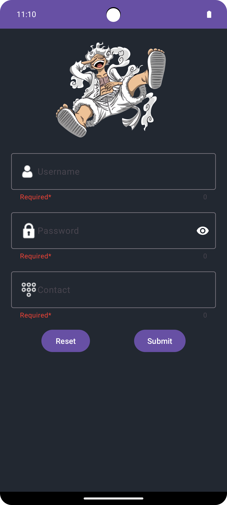

# Material Design Registration Page

This project demonstrates a simple registration page using Material Design components in an Android application. The layout includes text input fields for a username, password, and contact information, along with "Reset" and "Submit" buttons to handle user interactions.

## Features

- **Material Design Components**: Utilizes Material Design for a modern and user-friendly interface.
- **Input Validation**: Ensures that all fields are filled out correctly before allowing submission.
- **Reset Functionality**: Allows users to clear all input fields with a single click.
- **Responsive Layout**: Designed to look good on various screen sizes.

## Preview



## Installation

1. Clone the repository:

   ```bash
   git clone https://github.com/tbhhero/Material_Design.git
   ```

2. Open the project in Android Studio.

3. Build the project to download the required dependencies.

4. Run the application on an Android device or emulator.

## Usage

Once the application is running:

1. Enter a username, password, and contact number in the respective fields.
2. Use the **Reset** button to clear all inputs.
3. Click the **Submit** button to complete the registration process.

## Project Structure

- **MainActivity.kt**: The main activity that handles user inputs, validation, and button actions.
- **activity_main.xml**: The layout file containing the Material Design UI components.
- **drawable**: Contains images and icons used in the app.
- **styles.xml**: Defines custom styles for Material Design components.

## Dependencies

- [Material Components for Android](https://github.com/material-components/material-components-android)

## Contributing

If you'd like to contribute to this project, please fork the repository and submit a pull request.

## License

This project is licensed under the MIT License. See the [LICENSE](LICENSE) file for details.

## Contact

For any inquiries or issues, feel free to open an issue on GitHub or contact me directly.

## Acknowledgements

- [Material Design](https://material.io/develop/android) for the design guidelines and components.

  ##Author
  @tbhhero
